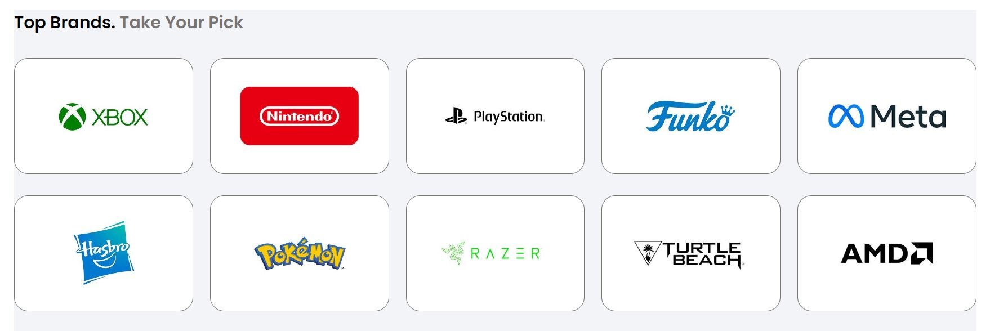

# Procesverslag
Markdown is een simpele manier om HTML te schrijven.  
Markdown cheat cheet: [Hulp bij het schrijven van Markdown](https://github.com/adam-p/markdown-here/wiki/Markdown-Cheatsheet).

Nb. De standaardstructuur en de spartaanse opmaak van de README.md zijn helemaal prima. Het gaat om de inhoud van je procesverslag. Besteedt de tijd voor pracht en praal aan je website.

Nb. Door *open* toe te voegen aan een *details* element kun je deze standaard open zetten. Fijn om dat steeds voor de relevante stuk(ken) te doen.

## Jij

  
uitwerken voor kick-off werkgroep

  ### Auteur:
  Melvin Vermast

  #### Je startniveau:
  Rood

  #### Je focus:
  Responsive
 

## Je website

  
uitwerken voor kick-off werkgroep

  ### Je opdracht:
  Gamestop : https://www.gamestop.com/

  #### Screenshot(s) van de eerste pagina (small screen): 
  Homepagina 
  

  #### Screenshot(s) van de tweede pagina (small screen):
  Detailpagina Super Mario Wonder 
  
 

## Toegankelijkheidstest 1/2 (week 1)

  
uitwerken na test in 2e werkgroep

  Gemaakt met Dave
  ### Bevindingen
  Lijst met je bevindingen die in de test naar voren kwamen:
  - Er zitten een paar niet duidelijke termen op de website van GameStop
  - Code had veel errors en warnings, maar werkte wel
  - Volgorde was wel duidelijk maar kon niet compleet bestuurd worden met het keyboard
  - Er is niet veel witruimte om te scrollen op telefoonformaat, maar je kan 
  over de plaatjes heen scrollen.
  - Hoofdpagina had meerdere h1 elementen en andere detailpagina's weer helemaal
  geen
  - Alle lijstjes zijn gemaakt met ul en li en zijn voorzien van bulletpoints
  - Website had geen ingewikkelde plaatjes die een speciaal onderschrift nodig
  hadden
  - Er zijn alleen wat slideshows, deze kan op pauze gezet worden door met je muis
  erover heen te hoveren
  - Bijna elk element is een a omdat het naar een andere pagina gaat, de buttons
  zijn wel duidelijk als een button gedesigned
  - Dark mode is niet ondersteund maar high contrast wel. Website is goed responsive
  wanneer de tekstgrootte wordt vergroot (hij lijkt dan erg op de mobiele versie)
  - Enige animatie die de website heeft is de slideshows, deze kunnen op pauze gezet worden
  - De hele website is zwart op wit. Dus een goed contrast, alleen de plaatjes zijn allemaal verschillend dus verschilt het contrast ook. ::selection was niet te vinden

## Breakdownschets (week 1)

  
uitwerken na afloop 3e werkgroep

  ### de hele pagina: 
  Dit was de breakdown van de hele pagina, de pagina is alleen in de tussentijd alweer geupdate naar iets anders. '
  De meeste onderdelen zijn hetzelfde alleen is er geen plaatje meer bovenin
  

  ### dynamisch deel (bijv menu): 
  Het hamburgermenu kan nog lastig worden omdat het uit meerdere lagen bestaat die over elkaar heen vallen
  

  ### wellicht nog een dynamisch deel (bijv filter): 
  De slider wordt vaak herhaald en heeft knoppen eronder zitten zodat je kan skippen naar een volgend gedeelte
  

## Voortgang 1 (week 2)

  
uitwerken voor 1e voortgang

  ### Stand van zaken
  Ik had nog niet echt met grids gewerkt in html/css dus het was leuk maar werkte ook goed om te werken met Grid Garden.
  

  Ik was begonnen met het maken van de navigatiebalk voor mijn website. Hier ben ik nog niet klaar mee (want moet het hamburgermenu nog),
  maar hier kwam ik aardig zelfstandig uit met maar een beetje moeite.
  

  Wat er beter ging was het maken van de korte artikelen voor de games die binnenkort uitkomen of net zijn uitgekomen.
  

  ### Agenda voor meeting
  samen met je groepje opstellen

  | student 1      | student 2          | student 3       | student 4        |
  | Melvin         | Evi                | Maxwell         | ---              |
  | - Hamburgermenu| - Hamburgermenu    | - Hamburgermenu | en dan ik dat    |
  | - Plaatjes ipv | - Footer Grid/Flex | - Grid/Flex?    | dit wil ik zeker |
  | code           | - Img position     |                 | ...              |

  ### Verslag van meeting
  hier na afloop snel de uitkomsten van de meeting vastleggen

  - Ik kan een class voor de screenreader elementen gebruiken zodat ik ook h elementen kan gebruiken in sommige sections
  - De divs die ik op het moment gebruik kan ik misschien ook nog vervangen naar een section. (sections in sections is semantisch)
  - Meer commentaar bij de code van waarop ik het op die manier heb geschreven
  - Niet sommige p in full caps schrijven, maar gebruik maken van text-transform
  - Media queries niet in 1 stuk onderaan mijn CSS maar per onderdeel waar het over gaat  

## Voortgang 2 (week 3)

  
uitwerken voor 2e voortgang

  ### Stand van zaken
  Ik was wel al beetje bekend met flexbox, maar het maken van de Flexbox Froggy opdrachten werkte als een goede opfrissing en kon ik hier vaker even naar terug kijken van hoe het ook al weer moest.
   

  Het hamburgermenu heb ik afgekregen, maar heb moeite met de uitbreiding ervan. Er moet namelijk een nieuw gedeelte weer over het hamburger vallen. 
  
  
  Ik heb ook een slideshow gemaakt die ik geanimeerd heb, maar hij gaat te snel en wordt niet geloopt.
  
  

  ### Agenda voor meeting
  samen met je groepje opstellen

  | student 1      | student 2          | student 3    | student 4        |
  | Melvin         | ---                | ---          | ---              |
  | - Hamburgermenu| en dit             | en ik dit    | en dan ik dat    |
  | uitbreiding    | dit als er tijd is | nog een punt | dit wil ik zeker |
  | - Slideshowloop| ...                | ...          | ...              |

  ### Verslag van meeting
  hier na afloop snel de uitkomsten van de meeting vastleggen

  - Ik kan het hamburger menu uitbreiding maken met een translate in combinatie met een overflow:hidden.
  - De slideshow kan ik of maken dat hij gewoon voor terug gaat in die volgorde of ik moet ervoor zorgen dat het plaatje in het begin waar aan het einde wordt toegevoegd.
  - Om meer pauze tussen de plaatjes te creëeren moet ik meer stappen in mijn animatie maken (meerdere %en toevoegen)

## Toegankelijkheidstest 2/2 (week 4)

  
uitwerken na test in 9e werkgroep

  Gemaakt met Danay
  ### Bevindingen
  Lijst met je bevindingen die in de test naar voren kwamen (geef ook aan wat er verbeterd is):
  - Ik had duidelijke tekst gebruikt voor mijn website
  - Ik had wel een lang attribuut in mijn website maar had de hele website in engels gemaakt ipv nl, dus deze heb ik na die tijd meteen aangepast naar lang="en"
  - De volgorde van de keyboard shortcuts was goed, maar ik had nog veel elementen niet op de juiste manier aangegeven. Zo had ik heel veel elementen dat een <a> of een <button> moest zijn niet aangegeven.
  - Op sommige locaties kan je nog een beetje horizontaal scrollen omdat de website nog niet goed responsive was.
  - Ik heb geen heading levels geskipt, maar ik had wel een warning dat ik mijn h1 op de verkeerde manier had gebruikt. Deze heb ik als logo in mijn navigatie balk omdat er niet een betere plek voor is op de website.
  - Alle lijstjes zijn gemaakt met ul/li en hebben bulletpoints
  - Ik had geen ingewikkelde plaatjes zoals grafieken op mijn pagina staan, maar ik moet wel de plaatjes die tekst bevatten beter uitleggen in de alt
  - De animatie die ik heb gemaakt kan niet gepauzeerd worden. Voor de rest bevat mijn website geen video of audio
  - Skip links is overbodig maar mijn links die naar andere pagina gaan had ik nog niet echt aangemaakt, maar kunnen ook moeilijk duidelijk worden weergegeven op de website.
  - Dark mode en high-contrast mode zijn niet ondersteund, maar dat was ook niet mijn focus. Mijn focus was vooral responsiveness
  - Ik heb geen teksten die plaatjes overlappen, want bij alle plaatjes met tekst, zit de tekst in het plaatje
  - Ik heb geen ::selection colors
  
  
  
  
  

## Voortgang 3 (week 4)

  
uitwerken voor 3e voortgang

  ### Stand van zaken
  Ik maak veel vooruitgang met het maken van mijn website maar ik loop tegen een paar kleine dingetjes nog aan. Ik heb veel sections gebruikt als vervanging voor een div. Maar deze moeten allemaal een <h> element bevatten. Ik had geleerd dat dit voor screenreaders wel handig is maar ik wist niet precies hoe ik deze dan niet in beeld kan laten zien.
  

  Ik weet dat ik mijn bronnen moet vermelden maar de meeste bronnen die ik gebruik is even voor kort opzoeken hoe een specifiek element werkt. En neem ik niet per se echt code over. Moet ik deze dan ook allemaal vermelden. Bronnen waar ik wel code van overneem heb ik uiteraard wel vermeld.

  De website van GameStop gebruikt een table element, ik dacht zelf dat we dit niet mochten gebruiken en met grids moesten werken. Op het moment heb ik hem wel als een table staan.
  

  ### Agenda voor meeting
  samen met je groepje opstellen

  | student 1      | student 2          | student 3    | student 4        |
  | Melvin         | ---                | ---          | ---              |
  | - Wanneer <h>  | en dit             | en ik dit    | en dan ik dat    |
  | - echt ALLE    | dit als er tijd is | nog een punt | dit wil ik zeker |
  | bronnen melden?| ...                | ...          | ...              |

  ### Verslag van meeting
  hier na afloop snel de uitkomsten van de meeting vastleggen

  - het gebruik van een <h> element is een beetje wisselvalig. Ligt eraan hoe de screenreader het voorleest
  - voor specifiek iets opzoeken is het beter om de bron erbij te zetten, maar als het alleen even opzoeken is hoe een element werkt kan ik in het algemeen de bron eenmalig neerzetten.
  - table mag gebruikt worden zolang het goed gebruikt wordt
  - de grid voor smbw geeft automatisch rows, dus moet zelf aangeven waar ze moeten beginnen
  - Ik kan de sr-only class doen met de informatie van: https://css-tricks.com/inclusively-hidden/

## Eindgesprek (week 5)

  
uitwerken voor eindgesprek

  ### Je uitkomst - karakteristiek screenshots:
  
  

  ### Dit ging goed/Heb ik geleerd: 
  Tijdens het maken van deze opdracht heb ik veel leren werken met grids. Dit had ik hiervoor nog niet echt gedaan. Deze heb ik dan ook op meerdere plekken geprobeerd te verwerken.
  
  

  Ook heb ik een wat meer advanced animatie gemaakt voor mijn slideshow. Ik ben hier aardig trots op dat dit is gelukt.
  
  

  ### Dit was lastig/Is niet gelukt:
  Het is me helaas niet gelukt om in de javascript een stuk code semantisch te doen. De manier die ik had gevolgd werkte helaas niet met een classList.add
  daardoor moest ik gebruik maken van een .style. Dit is uiteraard CSS in het JS bestand wat niet hoort. Ik heb mijn andere code wel in de comment erbij
  gezet.
  

  Ik heb helaas geen tijd gehad om ervoor te zorgen dat de slides van de slider ook geskipt kan worden met de buttons eronder.
  

## Bronnenlijst

  
continu bijhouden terwijl je werkt

  Nb. Wees specifiek ('css-tricks' als bron is bijv. niet specifiek genoeg). 
  Nb. ChatGpT en andere AI horen er ook bij.
  Nb. Vermeld de bronnen ook in je code.

  1. Voor het scalen tijdens hover: https://www.w3schools.com/howto/howto_css_zoom_hover.asp
  2. Voor alles van de screenreader: https://css-tricks.com/inclusively-hidden
  3. iets specfieks voor een <a>: https://stackoverflow.com/questions/18585069/why-anchor-tag-does-not-take-height-and-width-of-its-containing-element
  4. Voor responsiveness van CollectFest gedeelte: https://stackoverflow.com/questions/36005898/how-to-not-display-child-div-when-outside-parent-div-border
  5. Voor het maken van de slideshow: https://codepen.io/tojowe/pen/xxrLpv?editors=1100
  6. Voor het zichtbaar/ontzichtbaar maken aan de hand van een knop: 
  https://www.w3schools.com/howto/tryit.asp?filename=tryhow_js_toggle_hide_show
  7. Voor algemeen elementen opzoeken: https://developer.mozilla.org/en-US/docs/Web/CSS
  8. Voor algemeen elementen opzoeken: https://css-tricks.com/
  9. Leren van Flexbox: https://flexboxfroggy.com/#nl
  10. Leren van Grids: https://cssgridgarden.com/#nl

